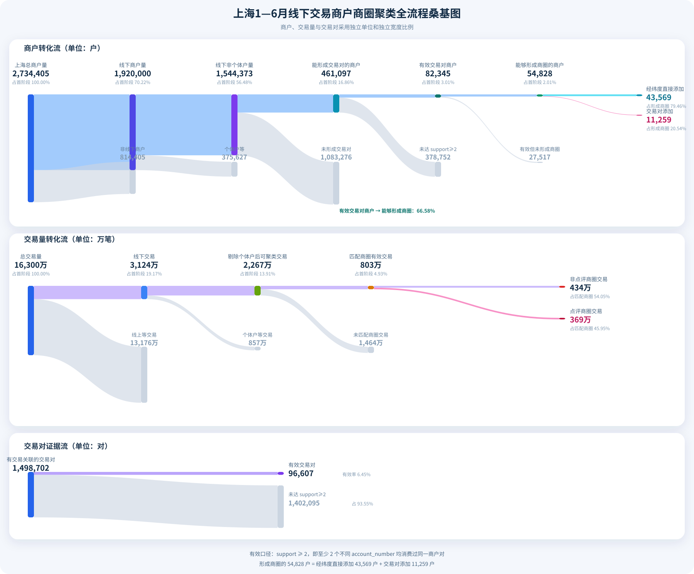

# 商圈聚类与增量归属算法方案


## 1. 方案结论

- 系统把商圈建模为商户图上的社区：商户是节点，持卡人在短时间内连续到访两个商户形成共现证据，边权表示这两个商户的局部关联强度。
- 初始化聚类的主链路是：交易清洗 → 到访合并 → 用户级商户对统计 → SPPMI/z-score 或共同交易强度建边 → 互为 top-k 稀疏化 → 地理异常商户剔除 → Leiden 社区发现 → 锚点候选与多商圈挂靠 → Hive 输出。
- 当前默认边权为 SPPMI，参数为：到访合并 30 分钟、共现窗口 120 分钟、时间衰减常数 60 分钟、最小支持人数 3、上下文平滑幂次 0.75、SPPMI 平移量 3、互为 top-k 的 k=15、最小 z-score 0.5、Leiden resolution=1、随机种子 42。
- 日常增量不重新发现社区，而是复用已有商圈成员：有可靠坐标的新商户在 3 公里内继承最近成员的商圈；没有可靠坐标时继承指向已有商圈成员的最强正图边；无法形成证据则标记为疑似孤立。

### 1.1 根据开发历史的演进

先验证算法闭环，再解决增量稳定性，最后解决数据质量和生产资源约束：

| 时间 | 主要变化 | 对现行方案的影响 |
| --- | --- | --- |
| 2026-06-24| 初始化 Python 项目、基础类型和兼容性修正 | 确立商户聚类代码骨架 |
| 2026-06-26 | 首次接入 Hive 聚类任务、商户对统计和连锁/泛客群识别 | 形成“交易图 + Hive 结果表”的第一个可运行版本 |
| 2026-06-30 | 完善连锁识别、社区结果和社区图可视化 | 开始关注算法平滑参数、锚点和结果解释性 |
| 2026-07-01 至 07-02 | 修正 Hive 数据读取，增加增量归属入口 | 从一次性初始化扩展到“初始化 + 日常增量”双路径 |
| 2026-07-02 至 07-03 | 简化商圈档案，商户对中间文件在 SQLite 与 pickle 之间调整 | 明确中间统计与业务结果分层，但后续又收敛为内存直连 |
| 2026-07-06 | 重构配置，尝试地理种子聚类 | 验证地理辅助方向；地理种子后来保留为历史能力，未进入当前初始化主路径 |
| 2026-07-08 至 07-10 | 简化配置、增加资源监测和状态码、收敛增量评分逻辑，完成初始化/增量通过版 | 从实验性评分转向确定性规则、状态化输出和可运行闭环 |
| 2026-07-13 至 07-16 | 区域覆盖写入、类型和模块重构、线上商户识别、参数校验 | 解决结果隔离、代码可维护性和异常商户处理 |
| 2026-07-20 至 07-25 | 优化 Hive 分块读取，减少内存消耗占用，增加商户对诊断、小商圈清理、坐标一致性和邮件输出 | 建立从原始交易、图筛选到业务结果的诊断与交付工具链 |
| 2026-07-28 至 07-31 | 日期范围、临时表覆盖写入、直接增量归属、地区过滤和商户对覆盖率 | 增量路径从复杂打分改为“最近坐标/最强正边”，并具备生产写入安全边界 |
| 2026-08-01 至 08-07 | 增加漏斗/桑基图、统一支持度统计、重构商户对分片和资源监测 | 将算法效果从“能跑”推进到可量化诊断和大数据量运行 |
| 2026-08-12 至 08-20 | 规范字段/状态/地区健壮性、目标输出日期 | 当前主线的核心稳定性、可复现性和数据契约基本定型 |
| 2026-09-07 | 增加 Hive 表目录清理脚本和测试 | 补齐线上任务维护能力；未改变图算法本身 |

当前方案沿着“图模型 → 增量归属 → 数据治理 → 生产化”逐步收敛。
## 2. 要解决的业务问题

传统商圈数据通常依赖人工维护或外部地理标签，存在三个问题：

- 新商户没有稳定的商圈标签，冷启动成本高。
- 交易数据中存在线上商户、全国性连锁、个体户和异常卡行为，直接按共同消费次数聚类容易把多个真实商圈粘成一个大社区。
- 商圈一旦初始化，后续每天还要处理新商户、异常状态、跨区域数据和已有商圈 ID，不能每次都从头人工重标。

本方案的核心假设是：在同一城市内，很多持卡人会在相近时间连续访问同一商圈中的多个线下商户；这种“跨用户重复出现的短时间共现”可以作为空间邻近的代理信号。它不是直接预测经纬度，而是通过行为关系重建局部商业空间。

## 3. 从理论模型到工程模型

### 3.1 图模型

设商户为节点 (m)，交易经过清洗后转化为到访事件。对持卡人 (u)，如果在时间窗内先后访问商户 (a,b)，则产生一条共现证据。所有持卡人的证据汇总为商户对强度：

\[
\kappa_u(a,b)=\exp\left(-\frac{\Delta t}{\tau}\right)
\]

\[
s_u(a,b)=\max\{\kappa_u(a,b)\}
\]

\[
C(a,b)=\sum_u s_u(a,b)
\]

其中，(	au) 是时间衰减常数，(s_u) 取同一持卡人对同一商户对的最大贡献，保证一个人的重复刷卡不会无限放大边权。`support(a,b)` 则是产生该商户对证据的不同持卡人数。

这一设计把“频繁交易”转化成“多用户重复共现”，重点保留人群广度，降低单个用户往返、分单和重复扣款对图的污染。

### 3.2 交易到访化

当前实现先按卡号和时间排序：

- 同一持卡人在同一商户相邻交易间隔小于 30 分钟时合并为一次到访。
- 同一张卡一天访问的商户数超过 100 时，整张卡的到访记录被过滤，避免异常卡或测试卡产生近似 (O(n^2)) 的垃圾商户对。
- 对每张卡的到访序列使用 120 分钟滑动窗口，只比较时间窗内的不同商户。
- 每个商户对的时间贡献使用 `exp(-minutes / 60)` 衰减。
- 同一持卡人在同一商户对上的多次证据只保留最大权重，跨持卡人再累加。

### 3.3 边权：SPPMI 主路径与共同交易次数备选路径

先保留 `support >= 3` 的商户对。对有效边计算边际量：

\[
C(a)=\sum_b C(a,b),\qquad T=\sum_{a<b}C(a,b)
\]

当前代码使用上下文平滑，并分别计算两个方向的 PMI，再取平均：

\[
S_\alpha=\frac{1}{2}\sum_x C(x)^\alpha
\]

\[
PMI_{a\rightarrow b}=\log\frac{C(a,b)S_\alpha}{C(a)C(b)^\alpha}
\]

\[
PMI(a,b)=\frac{PMI_{a\rightarrow b}+PMI_{b\rightarrow a}}{2}
\]

\[
SPPMI(a,b)=\max(PMI(a,b)-\log k,0)
\]

当前 (alpha=0.75)，(k=3)。同时计算独立假设下的期望共现量和 z-score：

\[
E(a,b)=\frac{C(a)C(b)}{T},\qquad z(a,b)=\frac{C(a,b)-E(a,b)}{\sqrt{E(a,b)}}
\]

只有 `SPPMI > 0` 且 `z-score >= 0.5` 的边进入 SPPMI 图。SPPMI 的作用是消除商户规模带来的“谁都消费过”的假关联；z-score 的作用是补充统计可信度。

代码还保留 `transaction_count` 模式：它跳过 SPPMI，直接把时间衰减后的共同交易强度作为边权，但仍保留最小支持人数、互为 top-k 和后续社区发现流程。进行过对照实验，上线的算法方案仍使用SPPMI。

### 3.4 互为 top-k 稀疏化

对每个商户按边权、支持人数和商户 ID 做稳定排序，只保留 top-15 邻居。边 (a-b) 只有在 (b) 进入 (a) 的 top-k 且 (a) 进入 (b) 的 top-k 时才保留。

这一步有两个作用：

- 把候选边数量从全量商户对压缩为局部邻域，降低 Leiden 的计算和内存成本。
- 即使一个高客流商户进入许多小商户的候选列表，只要它自身的反向 top-k 不包含这些商户，边就不会进入最终图，从结构上抑制 hub 污染。

### 3.5 社区发现与锚点

最终图交给 Leiden 的 `RBConfigurationVertexPartition`，使用边权、resolution=1 和固定随机种子 42。孤立节点单独成为社区，保证每个输入商户都可追踪。

对有边节点计算边权在不同社区之间的分布：

\[
P_i=1-\sum_s\left(\frac{k_{is}}{k_i}\right)^2
\]

当前实现把参与系数用于锚点筛选，而不是作为独立的迭代 hub 删除规则。锚点分数为：

\[
AnchorScore(i)=PageRank_{community}(i)\times(1-P_i)
\]

每个有效社区按规模确定锚点数量，排除连锁/泛客群商户以及参与系数超过 0.1 的商户，按锚点分、加权度、访问量和商户 ID 稳定排序。

商户如果连接到多个社区，普通商户使用最终清洗图中的社区权重分布展开多条成员记录；连锁/泛客群商户使用完整候选边对最终社区的权重分布展开多条记录，并输出 `community_share`、`is_primary_community` 和 `is_multi_community_member`，从而保留跨社区证据而不是强行单归属。

## 4. 一路上遇到的困难与解决方式

### 4.1 重复交易和刷卡频次会夸大关联

困难：同一持卡人短时间内多次刷卡、分单或退款，会让同一商户对看起来非常强；如果直接按交易笔数统计，少数用户可以制造虚假的空间关系。

解决：先合并到访，再在用户内对每个商户对取最大时间衰减权重，最后按持卡人数聚合，并设置最小支持人数。这样一条边需要多个用户重复支持，而不是由一个用户的交易频次决定。

### 4.2 线上商户和高客流商户会把社区粘连

困难：线上商户或泛客群商户可能与全城大量商户共现，形成高连接度 hub，把本来独立的商圈连成一个大社区。

解决分为三层：

1. 用 SPPMI 将实际共现与独立期望比较，弱化“规模大所以和谁都共现”的边。
2. 用 z-score、互为 top-k 和最小支持人数同时限制低频偶然边与单向 hub 边。
3. 在建图后，对没有可靠坐标但同时连接足够多有坐标商户、且这些坐标彼此超过 1 公里的节点标记为 `suspect_online` 并从 Leiden 输入图移除。当前入口阈值为 30 个有坐标邻居。

另外，商户分类为 `2` 的线下连锁店，以及访问量达到 `max(访问量 90 分位数, 100)` 的商户，会从社区发现图中排除，但仍使用候选边映射为普通成员或多商圈成员，并且不能成为锚点。


### 4.3 坐标既有价值，也有污染风险

困难：坐标可以识别“一个无坐标商户连接了相距很远的有坐标商户”，但输入中可能存在同一商户多组坐标、批量商户共享默认坐标或无效经纬度。

解决：

- 同一商户的有效经纬度必须唯一；冲突时明确报错，而不是静默选一条。
- 经纬度缺失一列、无法解析或越界时按无可靠坐标处理。
- 同一坐标关联商户数超过 100 时，整组坐标不参与地理判断和增量地理归属。
- 初始化聚类不把地理距离直接作为商户对边，避免坐标质量问题反向改变交易图；坐标只用于异常线上识别、质量排查和增量归属。


### 4.4 商户身份和输入数据不稳定

困难：商户名可能重复、分类冲突、流水重复，Hive 分片还可能包含重复读取或跨日期数据。如果这些问题进入图，会导致节点合并错误和结果不可复现。

解决：

- 当前节点 ID 使用输入商户标识，不在图阶段按品牌或名称做模糊合并。
- 同一商户对应多个分类直接报错；初始化和增量只保留分类 `1`、`2` 的线下商户进入聚类。
- Hive 入口校验必需字段、流水号唯一性、时间格式、地区和分区日期，并对重复流水只保留稳定排序后的第一条。
- 同一商户的已有 `business_district` 必须唯一；多商圈冲突直接报错。
- 地区先按参数表关联，再按分行允许的城市名过滤，跨区域记录转为明确状态，不混入正常图统计。

### 4.5 增量商户不能直接套用初始化社区发现

困难：每日任务需要写出完整商户快照，还要保留已有商圈 ID；如果每天重新跑全量 Leiden，成本高且会造成商圈 ID 漂移。

解决：

- 增量任务读取本次有效输入，重新计算本次窗口内的商户对和稀疏图，不读取旧的 pickle，也不合并过期统计。
- 已有非空商圈 ID 的商户优先保留原 ID。
- 新商户有可靠坐标时，遍历已有商圈成员，选择 3 公里内距离最近者；距离相同按商圈 ID和商户名稳定排序。
- 新商户没有可靠坐标时，选择指向已有商圈成员的最强正图边；没有这样的边则输出空商圈 ID并标记疑似孤立。
- 每个有效输入商户必须恰好对应一条增量结果，结果通过临时表写入后覆盖目标分区。

该策略解决了商圈 ID 稳定和日常归属效率问题，增量路径只把商户放入已有商圈，不能发现全新的商圈。
### 4.6 大数据量和 Hive 生产化

困难：商户对统计的候选比较量大，DataFrame、访问记录、边字典和图对象同时驻留容易触发内存峰值；Hive 输入又是按日期和 part 文件分布的，结果写入不能破坏其他地区数据。

解决：

- 按卡号分组并行统计商户对，工作进程每个任务完成后退出；父进程只维护累计字典，不保留每个分片的完整快照。
- 计算阶段输出卡数、访问量、候选比较数、商户对数、节点数和边数等阶段日志，便于判断是数据问题还是算法问题。
- 在交易对、图、归属和结果整理完成后及时释放中间对象并执行垃圾回收。
- 输入按分区目录和 `part*` 文件流式筛选地区，空分区或无匹配数据明确报错。
- 结果先写临时表，再用 `INSERT OVERWRITE` 覆盖目标日期分区；临时表在成功和失败路径均清理。
- 参数表通过 `is_daily` 在同一入口选择初始化或增量任务，避免两套配置漂移。

## 5. 当前主线流程

```text
Hive 参数表 + 交易分区
        │
        ├─ 参数/地区/城市/状态校验
        ├─ 过滤分类 1、2 的线下商户
        ├─ 流水去重、坐标解析、时间解析
        ├─ 同卡同商户 30 分钟内交易合并为到访
        ├─ 120 分钟窗口生成商户对，时间衰减，用户内取最大贡献
        ├─ support >= 3
        ├─ SPPMI + z-score（或 transaction_count 对照模式）
        ├─ 互为 top-15，构建稀疏图
        │
        ├─ 初始化：地理异常节点剔除 → Leiden → 锚点/多社区成员 → 最小社区过滤
        │                         └→ 新商圈 ID
        │
        └─ 增量：已有商圈保留 → 坐标最近邻或最强正边 → 疑似孤立状态
                                  └→ 原商圈 ID 稳定写回

临时表写入 → 目标分区覆盖 → 状态码与结果校验 → 任务收尾
```

## 6. 当前效果与证据边界


### 6.1 交易对覆盖诊断

上海 1—6 月漏斗和桑基图提供了业务口径：

- 2,734,405 个总商户中，线下商户 1,920,000 个，线下非个体户 1,544,373 个。
- 461,097 个商户能形成交易对，82,345 个商户进入 `support >= 2` 的有效交易对口径。
- 54,828 个商户能够形成商圈，其中 43,569 个来自经纬度直接添加，11,259 个来自交易对添加。
- 1,498,702 对有交易关联的商户对中，96,607 对满足 `support >= 2`，有效率为 6.45%。
- 另一张漏斗图统计到 52,929 个有商圈 ID 的有效交易对商户，和 54,828 的“能够形成商圈商户”不是同一张表、同一筛选口径，不能直接相除或当成同一个最终覆盖率。



图 1：上海 1—6 月线下交易商户、交易量和交易对证据的全流程转化。


